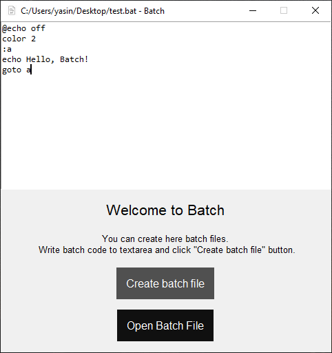

<h1>Batch - Create .bat file easily</h1>

<h2><b>Screenshot</b></h2>

</img>

Version: 0.2

<h2><b>How to setup?</b></h2>

    <h3>Download the setup file from releases, double click to file and click next and setuped 🥳</h3>

 
 
 
Contanct: Yasin#3649